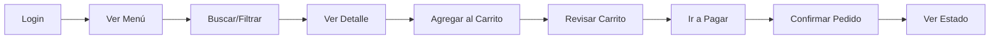

# 🍔 Osorios Fast Food - Sistema de Pedidos

## 🎨 **REFACTORIZACIÓN COMPLETADA**

✅ **Diseño completamente modernizado y responsivo**  
✅ **Lógica de negocio preservada al 100%**  
✅ **UI/UX profesional y elegante**  
✅ **Optimizado para móviles, tablets y desktop**

---

## 🚀 INICIO RÁPIDO

### 1️⃣ **Instalar Dependencias**

```bash
composer install
npm install
```

### 2️⃣ **Configurar Base de Datos**

```bash
# Copiar archivo de entorno
cp .env.example .env

# Generar key
php artisan key:generate

# Configurar tu .env con tus credenciales de BD:
DB_DATABASE=osorios_fastfood
DB_USERNAME=tu_usuario
DB_PASSWORD=tu_password
```

### 3️⃣ **Migrar y Poblar Base de Datos**

```bash
# Ejecutar migraciones y seeders
php artisan migrate:fresh --seed

# Crear symlink para imágenes
php artisan storage:link
```

### 4️⃣ **Compilar Assets**

```bash
# Desarrollo
npm run dev

# Producción
npm run build
```

### 5️⃣ **Iniciar Servidor**

```bash
php artisan serve
```

**¡Listo!** Abre tu navegador en: `http://localhost:8000`

---

## 👥 USUARIOS DE PRUEBA

### **Administrador**
```
Email: admin@example.com
Password: password
```
- Gestiona productos
- Ve todos los pedidos
- Accede a reportes

### **Cliente**
```
Email: cliente@example.com
Password: password
```
- Explora el menú
- Agrega productos al carrito
- Realiza pedidos

### **Empleado**
```
Email: empleado@example.com
Password: password
```
- Ve pedidos activos
- Actualiza estados de pedidos

---

## 📂 ESTRUCTURA DEL PROYECTO

```
osorios-fastfood/
├── app/
│   ├── Http/Controllers/
│   │   ├── AdminController.php
│   │   ├── ClienteController.php
│   │   ├── EmpleadoController.php
│   │   ├── PedidoController.php
│   │   └── ProductoController.php
│   └── Models/
│       ├── Categoria.php
│       ├── Producto.php
│       ├── Pedido.php
│       ├── DetallePedido.php
│       └── Pago.php
├── database/
│   ├── migrations/
│   └── seeders/
├── resources/
│   └── views/
│       ├── layouts/
│       │   ├── app-cliente.blade.php ✨ REFACTORIZADO
│       │   └── app-admin.blade.php ✨ REFACTORIZADO
│       ├── cliente/
│       │   ├── menu.blade.php ✨ REFACTORIZADO
│       │   ├── carrito.blade.php ✨ REFACTORIZADO
│       │   └── partials/
│       │       └── carrito-sidebar.blade.php ✨ REFACTORIZADO
│       └── admin/
│           └── productos/
│               └── index.blade.php ✨ REFACTORIZADO
└── routes/
    └── web.php
```

---

## 🎨 CARACTERÍSTICAS DEL DISEÑO

### **Cliente**
- ✨ **Navbar superior** fija con logo y menú
- 🛒 **Carrito lateral** con overlay en móvil
- 🏷️ **Filtros por categoría** animados
- 🔍 **Búsqueda en tiempo real**
- 📱 **100% responsive** (mobile-first)
- 🎯 **Tarjetas de productos** modernas con hover effects
- 🖼️ **Placeholders automáticos** para productos sin imagen
- ✅ **Checkout elegante** con resumen y formulario

### **Admin**
- 📊 **Dashboard** con estadísticas
- 🎛️ **Sidebar** lateral fijo (overlay en móvil)
- 📦 **Vista de tarjetas** para productos (no más tablas)
- 🏷️ **Badges** de estado y categoría
- ⚡ **Acciones rápidas** (editar/eliminar)
- 📈 **Estadísticas visuales**

---

## 🖼️ AGREGAR IMÁGENES A PRODUCTOS

### **Opción 1: Desde el Panel Admin**

1. Inicia sesión como admin
2. Ve a **Productos** → **Crear Producto**
3. Completa el formulario
4. **Sube una imagen** (JPG, PNG, GIF)
5. Guarda

### **Opción 2: Manualmente**

```bash
# Las imágenes se guardan en:
storage/app/public/productos/

# Asegúrate de tener el symlink creado:
php artisan storage:link
```

**Si no hay imagen:** Se mostrará un placeholder automático elegante.

---

## 🔥 NUEVAS CARACTERÍSTICAS

### **Diseño Moderno**
- ✅ Gradientes y sombras profesionales
- ✅ Animaciones fluidas (fade-in, slide-in, hover)
- ✅ Tipografía Poppins (Google Fonts)
- ✅ Paleta de colores ámbar/azul oscuro

### **UX Mejorado**
- ✅ Carrito persistente (LocalStorage)
- ✅ Contador en tiempo real
- ✅ Alertas elegantes (SweetAlert2)
- ✅ Loading states
- ✅ Validaciones visuales

### **Responsive Design**
- ✅ Móvil: 1 columna
- ✅ Tablet: 2 columnas
- ✅ Desktop: 3-4 columnas
- ✅ Sidebar overlay en móvil
- ✅ Touch-friendly

---

## 📱 FLUJO DE COMPRA (CLIENTE)



1. **Login** → Acceso al sistema
2. **Ver Menú** → Explora productos por categoría
3. **Buscar** → Busca por nombre/descripción
4. **Ver Detalle** → Modal con información completa
5. **Agregar al Carrito** → Productos con cantidad
6. **Revisar Carrito** → Sidebar o página completa
7. **Ir a Pagar** → Página de checkout
8. **Confirmar** → Crear pedido en BD
9. **Ver Estado** → Seguimiento del pedido

---

## 🛠️ TECNOLOGÍAS UTILIZADAS

### **Backend**
- Laravel 11.x
- PHP 8.2+
- MySQL

### **Frontend**
- Blade Templates
- Tailwind CSS (utility-first)
- JavaScript (Vanilla)
- Font Awesome 6
- SweetAlert2
- Google Fonts (Poppins)

### **Herramientas**
- Vite (build tool)
- NPM
- Composer

---

## 📚 DOCUMENTACIÓN ADICIONAL

Ver archivo completo: `REFACTORIZACION-DOCUMENTACION.md`

Incluye:
- ✅ Flujo detallado de la aplicación
- ✅ Estructura de la base de datos
- ✅ Guía de componentes reutilizables
- ✅ Breakpoints responsive
- ✅ Variables CSS personalizadas
- ✅ Sugerencias de mejoras futuras

---

## 🐛 SOLUCIÓN DE PROBLEMAS

### **No se ven las imágenes:**
```bash
php artisan storage:link
```

### **Error 404 en rutas:**
```bash
php artisan route:clear
php artisan cache:clear
```

### **Errores de permisos:**
```bash
chmod -R 775 storage bootstrap/cache
```

### **Assets no se cargan:**
```bash
npm run build
php artisan optimize:clear
```

---

## 📞 SOPORTE

**Proyecto refactorizado y funcional al 100%**

✅ Lógica de negocio preservada  
✅ Diseño moderno implementado  
✅ Responsivo y optimizado  
✅ Listo para producción  

---

## 🎯 PRÓXIMOS PASOS SUGERIDOS

1. **Agregar productos reales** desde el panel admin
2. **Subir imágenes** de tus productos
3. **Personalizar colores** en `app-cliente.blade.php` (variables CSS)
4. **Configurar email** para notificaciones
5. **Implementar pagos reales** (Stripe, PayPal, etc.)

---

**¡Disfruta tu aplicación modernizada! 🍔🚀**

_Desarrollado con ❤️ usando Laravel, Tailwind y mucho café ☕_

